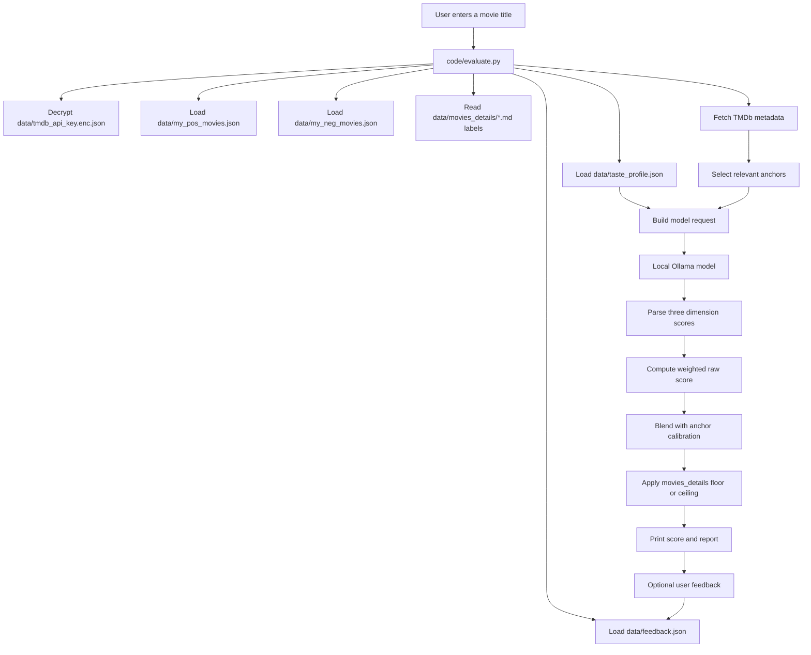
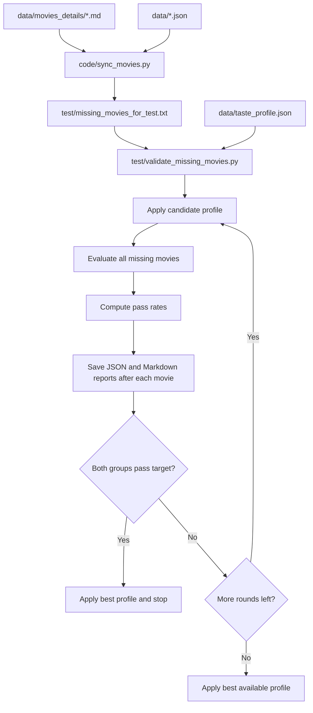
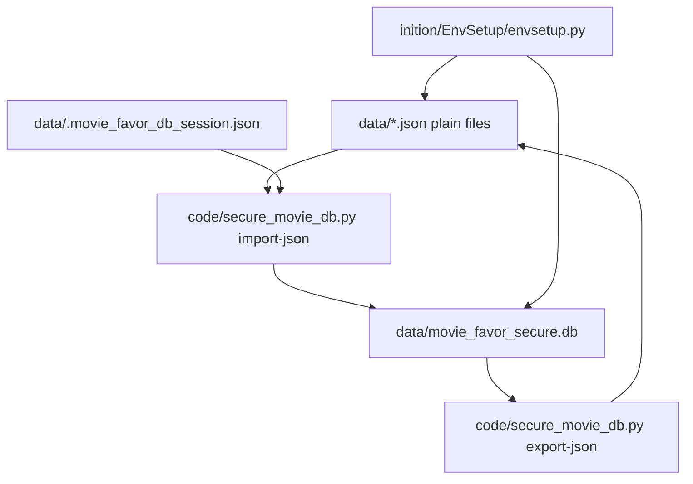
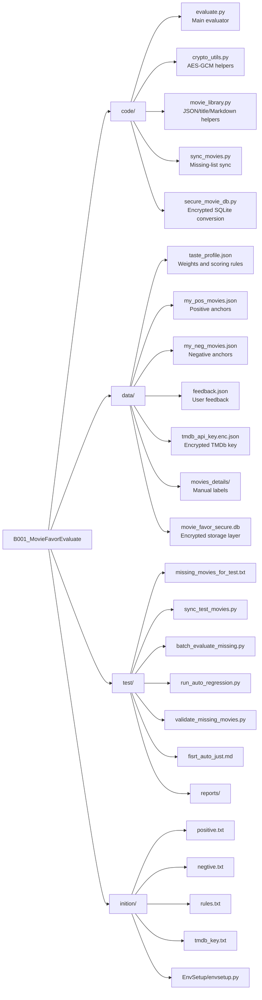

# MovieFavorEvaluate Architecture

MovieFavorEvaluate is a local personal movie preference evaluator. It combines manually curated preference data, TMDb metadata, a local Ollama model, feedback learning, regression testing, and an optional encrypted SQLite storage layer.

## Project Layout

```text
B001_MovieFavorEvaluate/
  code/       Application code and conversion utilities
  data/       Persistent plain JSON data, encrypted key, movie details, optional encrypted DB
  test/       Sync scripts, batch evaluation, regression scripts, test prompts, reports
  inition/    Template seed files and first-run environment setup
```

## Runtime Scoring Flow



## Regression Flow



## Encrypted Database Flow



## File Architecture



## File Responsibilities

| Path | Responsibility |
|---|---|
| `code/evaluate.py` | Interactive movie scoring, TMDb lookup, Ollama scoring, score calibration, feedback writing, and console loop. |
| `code/crypto_utils.py` | Windows-compatible AES-GCM encryption and decryption helpers. |
| `code/movie_library.py` | Shared JSON helpers, title normalization, alias generation, and Markdown movie-list parsing. |
| `code/sync_movies.py` | Builds `test/missing_movies_for_test.txt` from `data/movies_details` while excluding movies already present in JSON data. |
| `code/secure_movie_db.py` | Converts plain JSON data to/from encrypted SQLite, using encrypted fields plus HMAC title matching. |
| `data/taste_profile.json` | Configurable scoring profile: weights, anchor limits, learned features, calibration, and Ollama options. |
| `data/my_pos_movies.json` | Positive anchor movies. These are treated as 100-point examples. |
| `data/my_neg_movies.json` | Negative anchor movies below 50 points, each with rejection reasons. |
| `data/feedback.json` | User feedback records from real evaluations. |
| `data/tmdb_api_key.enc.json` | Encrypted TMDb API key payload. |
| `data/.tmdb_api_key_session.json` | Three-day Windows DPAPI-protected TMDb API key session cache. |
| `data/movies_details/00 record.md` | Negative manual movie detail list. |
| `data/movies_details/*.md` | Positive manual movie detail lists, except `00 record.md`. |
| `data/movie_favor_secure.db` | Optional encrypted SQLite storage and migration layer. |
| `data/.movie_favor_db_session.json` | Three-day encrypted database session file. |
| `test/missing_movies_for_test.txt` | Generated regression list for movies in `movies_details` but not yet in JSON data. |
| `test/sync_test_movies.py` | CLI wrapper for refreshing `missing_movies_for_test.txt`. |
| `test/batch_evaluate_missing.py` | Batch evaluator for missing movies. |
| `test/run_auto_regression.py` | Regression runner for JSON positive, negative, and optional feedback data. |
| `test/validate_missing_movies.py` | Main missing-movie regression tuner with restart/resume, multi-round candidates, pass-rate thresholds, and best-profile application. |
| `test/fisrt_auto_just.md` | Codex-facing tuning instruction file for first automatic adjustment. It is documentation, not executable code. |
| `test/positive_test.txt` | Small positive seed list for Codex-guided tuning. |
| `test/negitive_test.txt` | Small negative seed list for Codex-guided tuning. |
| `test/reports/` | Generated JSON/Markdown reports, logs, and profile backups. |
| `inition/positive.txt` | Plain text positive seed list for initializing a template project. |
| `inition/negtive.txt` | Plain text negative seed list for initializing a template project. |
| `inition/rules.txt` | Preference rules used by setup to refresh `taste_profile.json`. |
| `inition/tmdb_key.txt` | Local TMDb setup template. Real keys should not be committed. |
| `inition/EnvSetup/envsetup.py` | First-run automation: imports text seeds into JSON, encrypts TMDb key when needed, updates rules, and syncs encrypted SQLite. |

## Common Operations

### Run The Interactive Evaluator

```powershell
$env:MOVIE_TMDB_KEY_PASSWORD='<passphrase>'
python .\code\evaluate.py
```

After the first successful decrypt, the TMDb API key is cached for three days in a Windows DPAPI-protected session file. During that window, the evaluator can start without asking for the passphrase again.

### Refresh The Missing Movie Test List

```powershell
python .\test\sync_test_movies.py
```

### Run Missing Movie Regression

Start a fresh run:

```powershell
$env:MOVIE_TMDB_KEY_PASSWORD='<passphrase>'
python .\test\validate_missing_movies.py --rounds 10 --restart
```

Resume an interrupted run:

```powershell
$env:MOVIE_TMDB_KEY_PASSWORD='<passphrase>'
python .\test\validate_missing_movies.py --rounds 10 --resume
```

Current verified regression result:

- Positive: 50 / 54 passed, 92.6%.
- Negative: 18 / 20 passed, 90.0%.
- Best round: `round_01_current_profile`.
- Stop reason: `passed_target`.

### Initialize From Template Files

```powershell
python .\inition\EnvSetup\envsetup.py
```

The setup script reads `inition/positive.txt`, `inition/negtive.txt`, `inition/rules.txt`, and `inition/tmdb_key.txt`; appends new records to JSON; removes processed seed lines; and imports data into the encrypted SQLite database.

### Import Plain JSON Into Encrypted SQLite

```powershell
$env:MOVIE_DB_PASSWORD='<passphrase>'
python .\code\secure_movie_db.py import-json
```

### Export Encrypted SQLite Back To Plain JSON

Preview counts without overwriting:

```powershell
$env:MOVIE_DB_PASSWORD='<passphrase>'
python .\code\secure_movie_db.py export-json
```

Overwrite plain JSON files from the encrypted database:

```powershell
$env:MOVIE_DB_PASSWORD='<passphrase>'
python .\code\secure_movie_db.py export-json --overwrite
```

## Design Notes

- Regression reports do not participate in normal scoring.
- Normal scoring reads plain JSON files and `movies_details` directly.
- The encrypted SQLite database is currently an additional storage and migration layer, not the active runtime source for scoring.
- `movies_details` labels are active scoring evidence:
  - positive labels can lift scores to `movies_details_positive_floor`;
  - negative labels can cap scores at `movies_details_negative_ceiling`.
- A true blind generalization test should disable `movies_details` calibration and evaluate through TMDb, JSON anchors, feedback, and the model only.
- Real API keys and session files should stay local and out of Git.
- TMDb key sessions are protected by Windows DPAPI for the current user and expire after three days.
