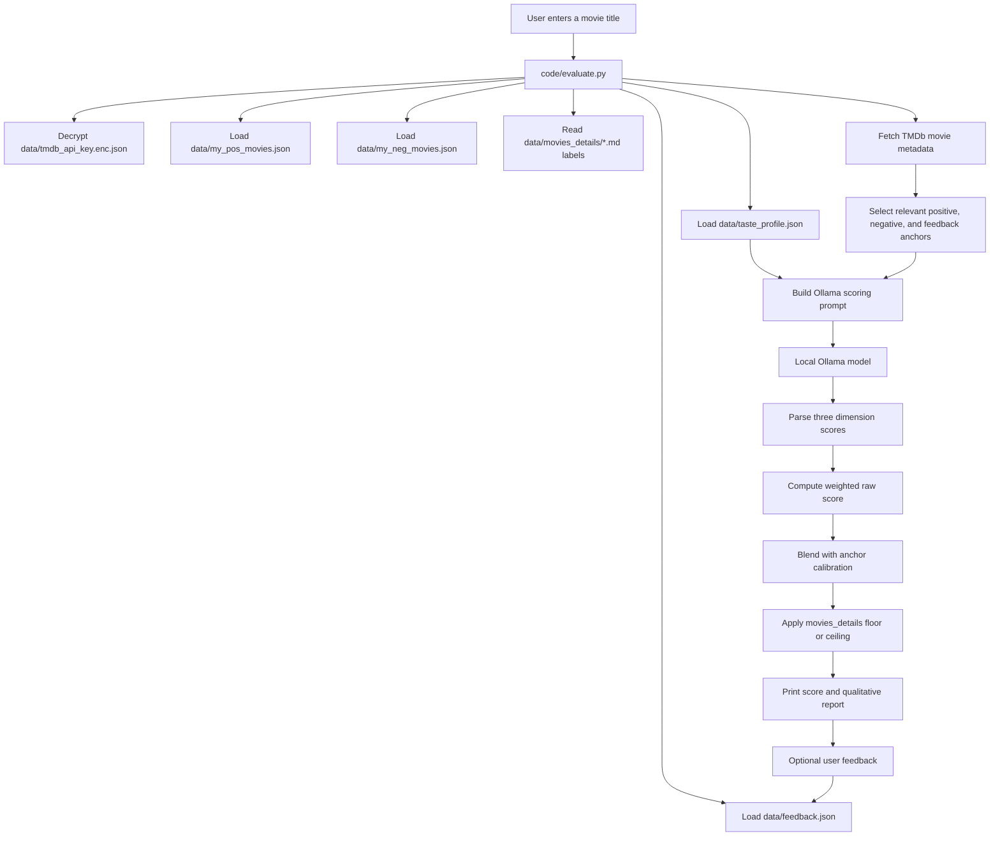
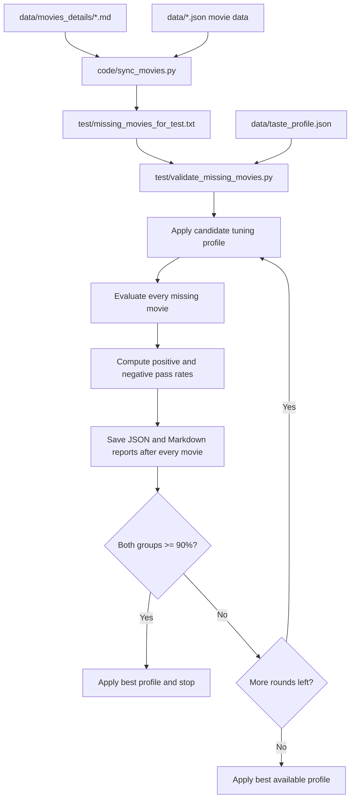
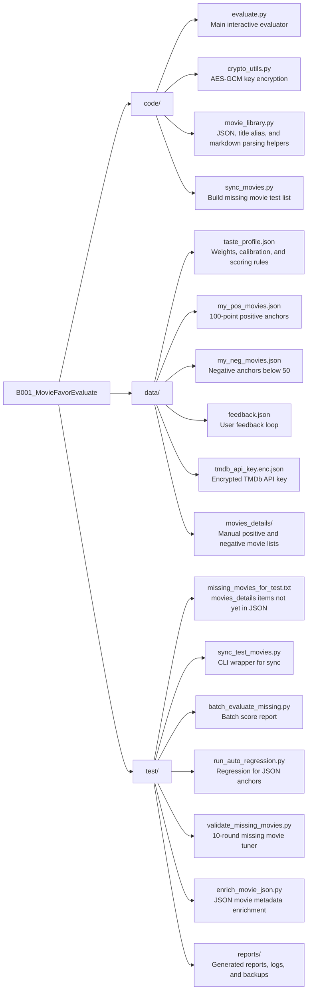

# MovieFavorEvaluate: Build Prompt Playbook and Architecture

This document describes how to rebuild this project from scratch with an AI coding agent, and how the current files are organized.

The project is a personal movie recommendation evaluator. It combines:

- Personal positive and negative movie anchors stored as JSON.
- Ongoing feedback stored as JSON.
- Movie detail lists stored as Markdown files.
- TMDb metadata lookup.
- A local Ollama model for qualitative scoring.
- Regression testing over the missing movie test set.
- AES-GCM encryption for the TMDb API key.

## End-to-End Build Prompt Flow

Use the following prompts in order when asking an AI coding agent to build or recreate the project.

### 1. Project Goal

```text
Build a local personal movie preference evaluator in Python.

The tool should evaluate a movie by combining TMDb metadata, a local Ollama model, my personal positive movie anchors, negative movie anchors, and historical feedback.

The output should include three dimension scores:
1. Script and human depth.
2. Visual language and director style.
3. Personal taste fit.

The final score should be a weighted recommendation score from 0 to 100.
```

### 2. Folder Structure

```text
Create a clear project structure:

- code/: application source code.
- data/: all persistent data files.
- data/movies_details/: manually maintained movie detail lists.
- test/: sync, batch evaluation, and regression scripts.
- test/reports/: generated reports and backups.

Keep all persistent user data as JSON, not JSONL.
```

### 3. Data Standards

```text
Define the preference standard:

- Movies in data/my_pos_movies.json are trusted positive anchors and should be treated as 100-point examples.
- Movies in data/my_neg_movies.json are negative anchors under 50 points, but not necessarily 0.
- Movies in data/feedback.json store real user feedback and should influence later scoring.
- In data/movies_details/, 00 record.md is negative; every other markdown file is positive.
- Every positive/negative JSON item should include a short core reason explaining why it is accepted or rejected.
```

### 4. Taste Profile

```text
Create data/taste_profile.json to store configurable scoring behavior:

- Anchor score rules.
- Sample importance for positive, negative, and feedback anchors.
- Anchor selection limits.
- Dimension weights.
- Learned positive and negative core features.
- Score calibration settings.
- Ollama options such as low temperature for repeatable regression tests.

The program should load this profile every time it evaluates a movie so that the scoring behavior can be adjusted without changing code.
```

### 5. Positive and Negative Preference Features

```text
Add the following preference tendencies to the scoring standard:

Positive signals:
- Fantasy, large-scale sci-fi, disaster, magic, and large action movies can receive a natural bonus when they are satisfying and well executed.
- True stories, biographies, historical adaptations, and documentary-like historical stories receive a natural bonus.
- Stories about resilience, courage, human dignity, or deep emotional relationship analysis receive a natural bonus.
- Directors already appearing in my positive movies or high-score feedback can receive a moderate bonus.

Negative signals:
- Horror, pure commercial formula movies, puzzle-like suspense, war movies, and abstract art films should receive moderate penalties unless they have strong human depth, historical texture, or emotional grounding.
```

### 6. TMDb API Key Encryption

```text
Do not store the TMDb API key in plain text.

Implement AES-GCM encryption/decryption for the TMDb key.
Store the encrypted payload as data/tmdb_api_key.enc.json.
On startup, ask for a passphrase or read it from an environment variable.
Never hard-code the passphrase in source code.
```

### 7. Main Evaluator

```text
Implement code/evaluate.py.

Requirements:
- Load the taste profile, positive anchors, negative anchors, feedback, and movies_details labels.
- Decrypt the TMDb API key at startup.
- Search TMDb for the requested movie and fetch detail metadata and credits.
- Select relevant positive, negative, and feedback anchors by text relevance.
- Build an Ollama system prompt using the taste profile and selected anchors.
- Parse the model output into three dimension scores.
- Compute a weighted raw score.
- Blend the model score with anchor-derived calibration.
- Apply movies_details calibration:
  - positive movie details should have a configurable minimum floor.
  - negative movie details should have a configurable maximum ceiling.
- Let the user optionally enter real feedback after each evaluation.
- Save feedback to data/feedback.json.
- Keep the console running until the user explicitly quits.
```

### 8. Sync Missing Test Movies

```text
Implement code/sync_movies.py and test/sync_test_movies.py.

The sync logic should:
- Read every movie from data/movies_details/*.md.
- Treat 00 record.md as negative and all other files as positive.
- Compare those movies against every JSON data file that already stores movie titles.
- Write movies not found in JSON data to test/missing_movies_for_test.txt.
- Remove a movie from the test file automatically once it appears in another JSON file such as feedback.json.
```

### 9. Batch Missing Movie Evaluation

```text
Implement test/batch_evaluate_missing.py.

It should:
- Read test/missing_movies_for_test.txt.
- Evaluate each movie.
- Save a JSON report and a Markdown report.
- Support restart and dry-run modes.
- Save progress after each movie so interruptions do not destroy the run.
```

### 10. JSON Anchor Regression

```text
Implement test/run_auto_regression.py.

It should:
- Test data/my_pos_movies.json, data/my_neg_movies.json, and optionally data/feedback.json.
- Validate that known positive anchors score high and known negative anchors score low.
- Try candidate parameter sets.
- Save JSON and Markdown reports.

This test checks the JSON anchor set, not the movies_details missing test set.
```

### 11. Missing Movie Regression Tuning

```text
Implement test/validate_missing_movies.py.

It should:
- Use test/missing_movies_for_test.txt as the regression set.
- Run up to 10 full rounds by default.
- In each round, evaluate every movie in the missing list, not just a sample.
- Treat positive movies as passing when score >= 80.
- Treat negative movies as passing when score <= 65.
- Require at least 90% pass rate for both positive and negative groups.
- Stop early if a full round passes.
- If no round passes after all rounds, keep the best parameter set.
- Save JSON and Markdown reports after every movie.
- Support --resume so an interrupted run can continue from the last saved movie.
- Support --restart to start fresh.
- Apply the best profile back to data/taste_profile.json unless disabled.
```

### 12. Real Regression Run

```powershell
$env:MOVIE_TMDB_KEY_PASSWORD='<passphrase>'
python .\test\validate_missing_movies.py --rounds 10 --restart
```

Resume an interrupted run:

```powershell
$env:MOVIE_TMDB_KEY_PASSWORD='<passphrase>'
python .\test\validate_missing_movies.py --rounds 10 --resume
```

Current real regression result:

- Positive: 50 / 54 passed, 92.6%.
- Negative: 18 / 20 passed, 90.0%.
- Best round: round_01_current_profile.
- Stop reason: passed_target.

## Runtime Scoring Flow



## Regression Flow



## File Architecture



## File Responsibilities

| Path | Responsibility |
|---|---|
| `code/evaluate.py` | Main scoring console, TMDb lookup, Ollama prompt, score parsing, feedback saving, and movies_details calibration. |
| `code/crypto_utils.py` | Windows-compatible AES-GCM encryption and decryption helpers for the TMDb API key. |
| `code/movie_library.py` | Shared helpers for reading/writing JSON, normalizing titles, parsing movie detail Markdown files, and generating aliases. |
| `code/sync_movies.py` | Compares movies_details against JSON data and writes the missing test list. |
| `data/taste_profile.json` | Main configurable taste profile: weights, anchor limits, learned features, calibration, and Ollama options. |
| `data/my_pos_movies.json` | Positive anchor movies. Each item represents a movie worth watching and acts as a 100-point preference anchor. |
| `data/my_neg_movies.json` | Negative anchor movies below 50 points, each with a core rejection reason. |
| `data/feedback.json` | User-entered real evaluation feedback. It becomes future scoring evidence. |
| `data/tmdb_api_key.enc.json` | Encrypted TMDb API key payload. |
| `data/movies_details/00 record.md` | Negative movie detail list. |
| `data/movies_details/*.md` except `00 record.md` | Positive movie detail lists by category. |
| `test/missing_movies_for_test.txt` | Auto-generated test list of movies in movies_details that are not yet in JSON data. |
| `test/sync_test_movies.py` | Command-line sync entry point for refreshing missing_movies_for_test.txt. |
| `test/batch_evaluate_missing.py` | Batch evaluator that scores missing movies and writes reports. |
| `test/run_auto_regression.py` | Regression runner for JSON positive, negative, and optional feedback data. |
| `test/validate_missing_movies.py` | Main missing movie regression tuner with restart/resume, multi-round candidates, pass-rate thresholds, and best-profile application. |
| `test/enrich_movie_json.py` | Helper script to enrich JSON movie records. |
| `test/reports/*.json` | Machine-readable reports, backups, and saved regression state. |
| `test/reports/*.md` | Human-readable reports. |
| `test/reports/*.log` | Real run process logs. |

## Important Design Notes

- Regression reports do not participate in normal scoring.
- Normal scoring reads `taste_profile.json`, `my_pos_movies.json`, `my_neg_movies.json`, `feedback.json`, and `movies_details`.
- `movies_details` labels are currently active scoring evidence:
  - positive labels can lift scores to `movies_details_positive_floor`.
  - negative labels can cap scores at `movies_details_negative_ceiling`.
- A true blind generalization test should disable movies_details calibration and evaluate only through TMDb, anchors, feedback, and the model.
- The TMDb passphrase should be supplied interactively or through an environment variable, never committed as source code.

